# Atmega4809 Custom Development Board

## PCB Assembly

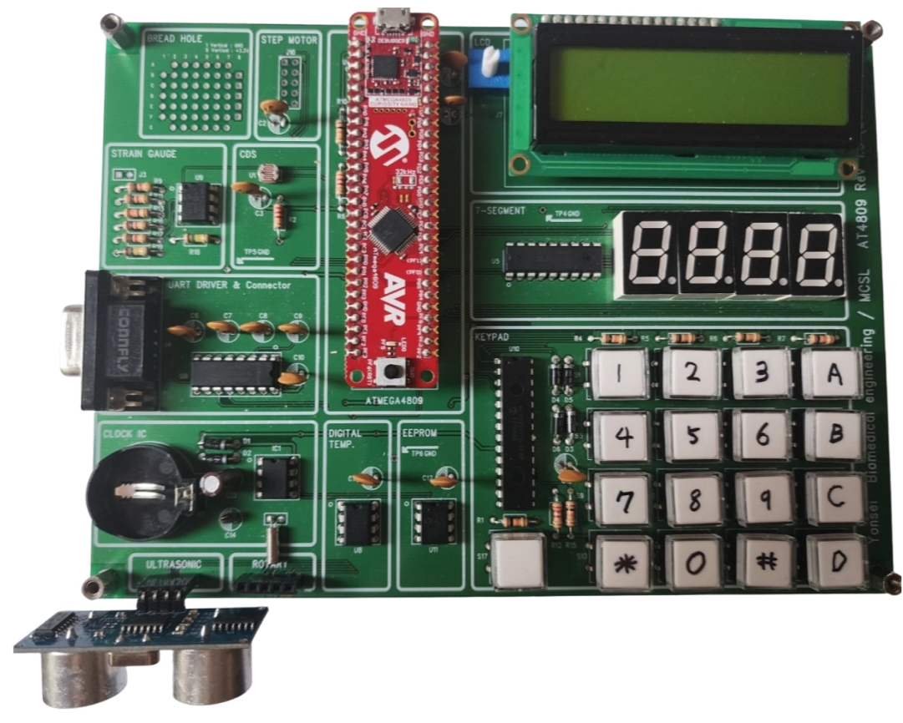

## 1. Introduction
본 프로젝트는 8-bit MCU의 동작 원리를 기초부터 학습하기 위해 진행되었습니다.  
Atmega4809 기반의 커스텀 개발 보드를 설계하여 GPIO, 타이머, ADC, UART 등 MCU의 핵심 기능을 실습형으로 익혔습니다.

## 2. Features
- Atmega4809 기반 2-layer PCB
- 안정적인 5V/3.3V 전원회로 포함
- MCU / TEMP / CDS SENSOR / STRAIN_GAUGE
- UART & 7 Segment Display
- Stepper Motor, Ultrasonic, Rotary Encoder, EEPROM
- IO Expander, LCD, Keypad (SPI)

## 3. Firmware Structure
- AVR-GCC 기반 빌드
- 레지스터 접근 기반 GPIO/ADC/UART/PWM 구현

## 4. Development Environment
- Microchip Studio : Atmega4809 펌웨어 개발 및 디버깅 환경
- Mentor Graphics PADS 9.5 : Schematic 및 PCB Layout 설계

## 5. 프로젝트 진행하면서 깨달은 점
- 폴링 방식을 넘어 인터럽트 방식을 활용한 데이터 수신 및 처리 방법 학습
- UART, SPI 및 I2C 통신 프로토콜의 원리를 깊이 이해하고 이를 기반으로 라이브러리를 구현
- 베이지안 필터와 칼만 필터에 대한 처음 접하게 되었으며, 이를 통해 실시간 데이터 필터링 및 추정을 수행하는 능력을 향상

## Circuits

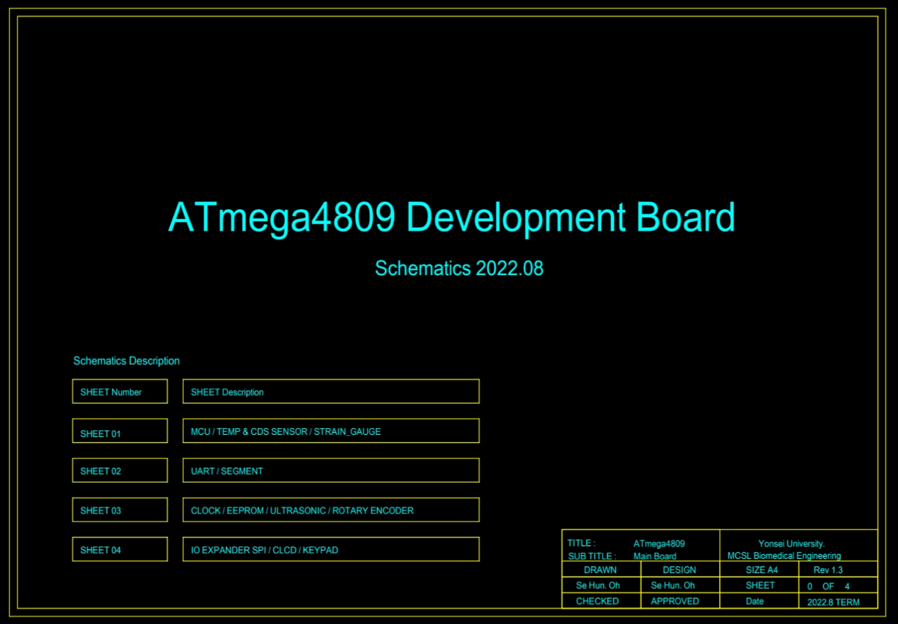

2. UART & 7 Segment Display

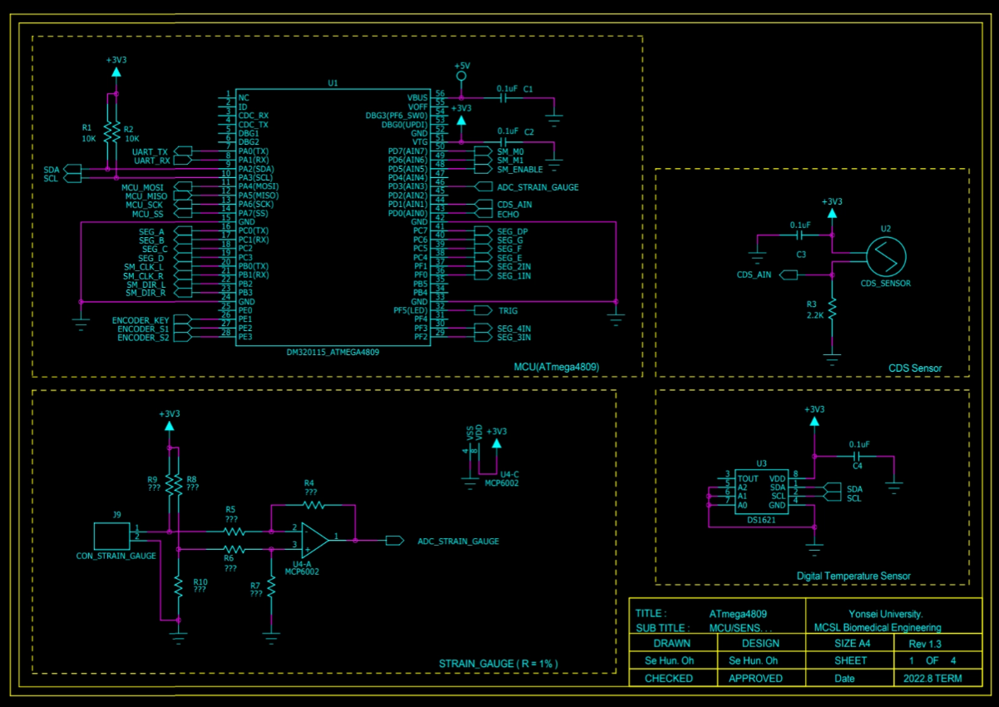

### 1.1 MCU (ATmega4809) :

- Description : 8-bit AVR microcontroller

- Operating Voltage : 3.3V

- Communication : UART, I2C, ADC, SPI

- Resistor (R1, 2) 10kΩ : I2C는 오픈 드레인 방식으로 Low 신호 생성만 가능하다. 따라서 풀업을 통해 High 신호를 생성해준다.

  저항값은 데이터 시트의 I2C Bus Pullup Resistor Calculation을 확인하는 것이 맞으나 일반적으로 표준 속도(100kHz)는 10kohm, 빠른 속도(400kHz)는 4.7kohm을 사용한다.

  장치가 병렬 연결됨에 따라 풀업 저항값을 정밀하게 계산해야한다.

### 1.2 CDS Sensor :

- Description : a light-sensitive resistor

- Operating Voltage : 3.3V

- Communication : ADC

- Resistor (R3) 2.2kΩ :

  Voltage Divider

  $$ V_{out} = V_{in} \times \frac{R_{CDS}}{R_{CDS} + R_3} $$

- Capacitor (C3) 0.1µF : Power supply stability

### 1.3 Strain Gauge :

- Description : Wheatstone Bridge + MCP6002 OP-AMP

- Operating Voltage : 3.3V

- Communication : ADC

- Resistor(R4~R7) : Setting the gain of the MCP6002 OP-AMP

  $$ V_{out} = \frac{R_4}{R_5} \times (V_{+} - V_{-})$$

  $$ {R_5}={R_6},{R_4}={R_7} $$

- Resistor(R8~R10) : Wheatstone Bridge

Wheatstone Bridge는 Voltage Divider와 달리 차동 측정 방식으로 정밀성, CMRR, 온도 보상에 우수하다.

Voltage Divisor

$$ V_{out} = V_{in} \times \frac{R_{sensor}}{R_{sensor} + R_{10}} $$

Wheatstone Bridge

$$ V_{out} = V_{in} \times \left( \frac{R_8}{R_8 + R_9} - \frac{R_{sensor}}{R_{sensor} + R_{10}} \right) $$

### 1.4 Digital Temperature Sensor (DS1621) :

- Description : Digital Temp Sensor
- Operating Voltage : 3.3V
- Communication : I2C (100kHz 오픈 드레인)
- Capacitor(C4) 0.1µF : Power supply stability

## 2. UART & 7 Segment Display

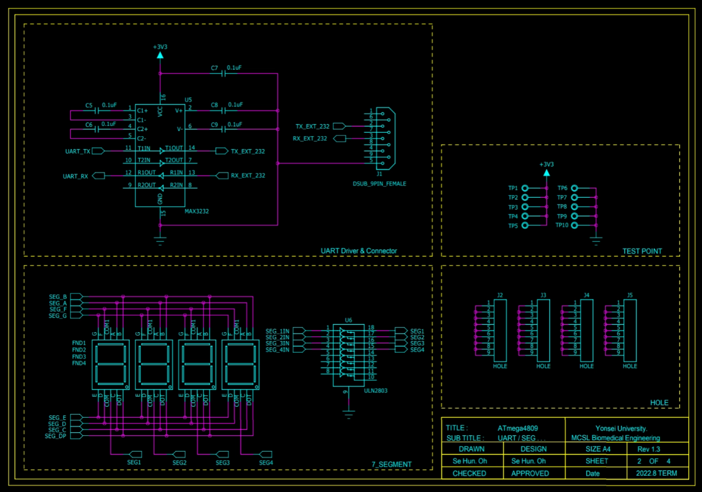

### 2.1 UART Driver & Connector :

- Description : MAX3232 IC
- Operating Voltage : 3.3V
- Communication : UART (RS-232)
- Capacitor(C5~C6) 0.1µF : 신호의 DC 성분 제거하는 Coupling Capacitor

- Capacitor(C7~C9) 0.1µF : Power supply stability

### 2.2 7 Segment Display :

- Description : 캐소드(Common Cathode) 방식 Segment
- Operating Voltage : 3.3V
- ULN2803 : 오픈 컬렉터 드라이버로, 낮은 전압의 신호로 높은 전압의 부하를 제어할 수 있게 해준다. 만약 높은 전압을 사용해야 될때 10번 핀에 전원을 인가해서 사용하면 된다.
- 오픈 컬렉터 (12V 연결 시)

## 3. Stepper Motor, Ultrasonic, Rotary Encoder, EEPROM

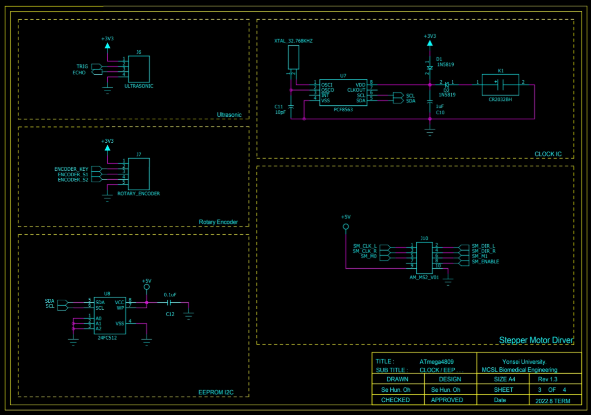

### 3.1 Ultrasonic :

- Description : Ultrasonic
- Operating Voltage : 3.3V
- Communication : TRIG와 ECHO를 이용한 자체 통신 방법

### 3.2 Rotary Encoder :

- Description : Digital Temp Sensor

- ENCODER_KEY : 스위치 기능 핀

- ENCODER_S1, ENCODER_S2 : S1과 S2의 비트를 확인하여 우측 회전, 좌측 회전 및 회전 수를 계산

  **Initial State**: ENCODER_S1 = 0, ENCODER_S2 = 0

  **1st Change**: ENCODER_S1 = 0, ENCODER_S2 = 1

  **2nd Change**: ENCODER_S1 = 1, ENCODER_S2 = 1

  **3rd Change**: ENCODER_S1 = 1, ENCODER_S2 = 0

  **4th Change**: ENCODER_S1 = 0, ENCODER_S2 = 0

### 3.3 RTC (PCF8563) :

- Description : 실시간 시계 IC로 32.768kHz 크리스탈과 CR2032 배터리를 사용
- Operating Voltage : 3.3V
- Communication : I2C (100kHz 오픈 드레인)
- Diode(D1)  : 전원이 불안정해 역전압이 흐를 때 역전압 방지
- Diode(D2)  : 배터리가 잘못 연결 되었을 때 역전압 방지
- 32.768kHz : 매 1초마다 정확하게 32,768회의 펄스를 카운트 할 수 있다.
- Capacitor(C11) 10pF : 크리스탈의 신호 무결성
- Capacitor(C10) 1µF : Power supply stability

### 3.4 EEPROM (24FC512) :

- Description : EEPROM
- Operating Voltage : 5V
- Communication : I2C (100kHz 오픈 드레인)
- WP (핀 7) : HIGH 상태로 연결하면 쓰기 보호 기능이 활성화
- Capacitor (C12) 0.1µF : Power supply stability

### 3.5 Stepper Motor :

- Description : Stepper Motor
- Operating Voltage : 5V
- SM_CLK_L / SM_CLK_R : 모터의 회전 속도를 제어
- SM_DIR_L / SM_DIR_R : 회전 방향을 설정
- SM_M0 / SM_M1 : 마이크로스텝 기능으로 회전을 더 부드럽고 정밀하게 제어
- SM_ENABLE  : 모터의 작동을 활성화

## 4. IO Expander, LCD, Keypad (SPI)

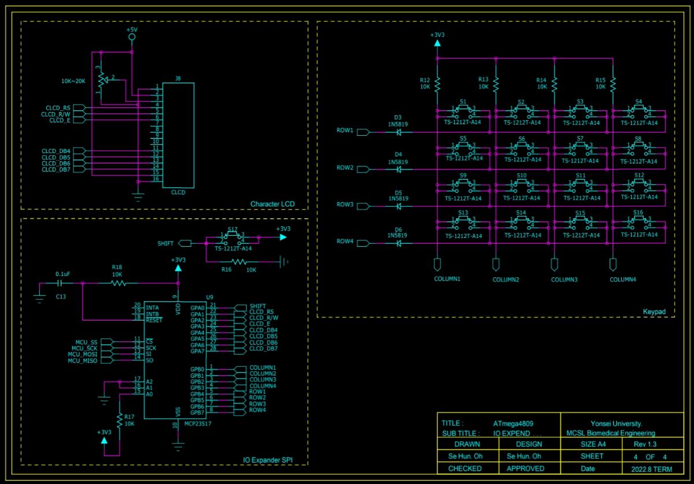

### 4.1 IO Expander (MCP23S17):

- Description : IO Expander
- Operating Voltage : 3.3V
- Communication : SPI
- Address pin (A0-A2) : 여러 MCP23S17 장치가 동일한 SPI 버스에서 사용될 때 장치 주소를 설정하는 핀
- Capacitor (C13) 0.1µF : Power supply stability
- Resistor (R17) 10kΩ : 장치 주소 설정 풀업 저항
- Resistor (R18) 10kΩ : 풀업 저항에 연결되어 MCP23S17이 제대로 리셋 되도록 한다.

### 4.2 16x2 LCD :

- Description : Stepper Motor
- Operating Voltage : 5V
- Communication : 4bit 병렬 통신
- CLCD_RS (Register Select) : 명령 레지스터와 데이터 레지스터를 선택
- CLCD_R/W (Read/Write) : Read/Write mode 선택
- CLCD_E (Enable): 데이터 송수신 활성화 신호
- CLCD_DB4 ~ CLCD_DB7 (Data Bus 4-7): 데이터 라인 4비트 모드
- Resistor (10kΩ~20kΩ) : LCD의 대비를 조절

### 4.3 Keypad :

- Description : Keypad
- Operating Voltage : 3.3V
- Communication : 열(Column)과 행(Row) 병렬
- Resistor (R12 ~ R15) 10kΩ : floating을 제거하기 위한 풀업 저항
- Diode (D3 ~ D6) : 신호의 역류 방지, 다중 입력(여러 키가 동시에 눌릴 때)의 간섭을 방지

# Part Layout

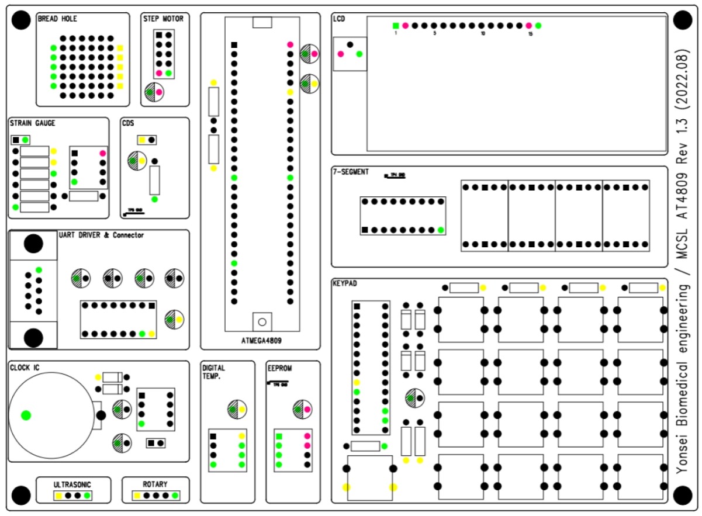

# Top Layer

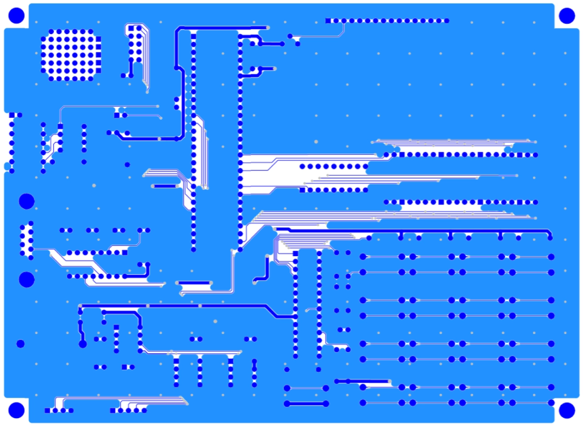

# Bottom Layer

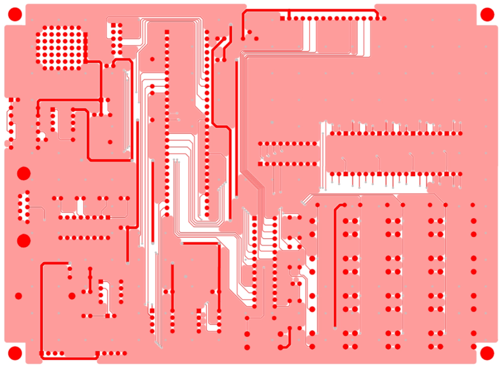

# Communication

## 1. UART 통신

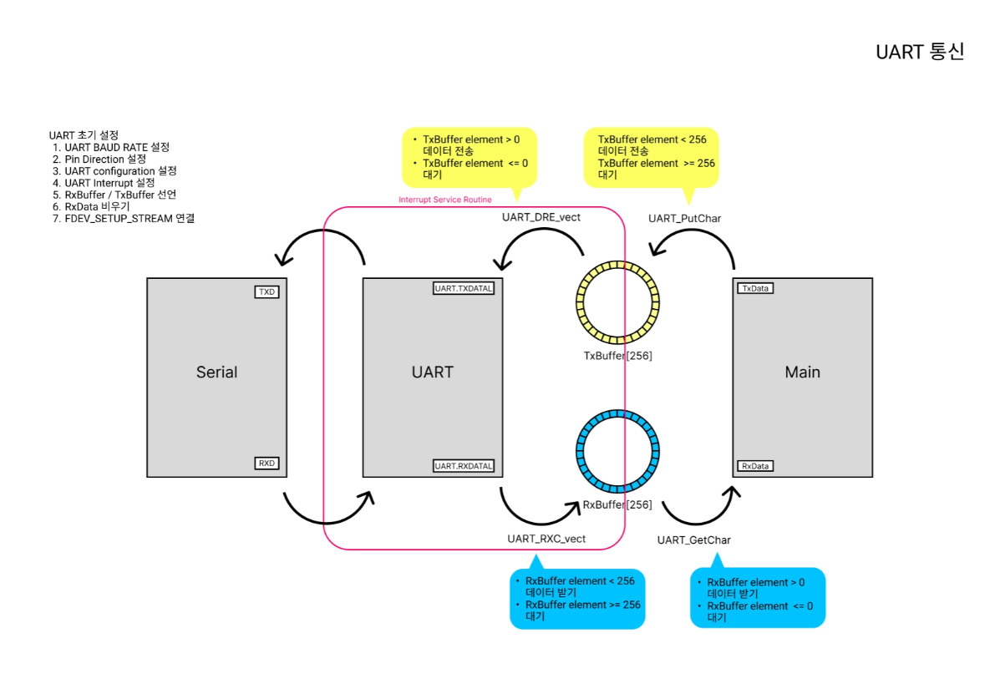

## 2. SPI 통신

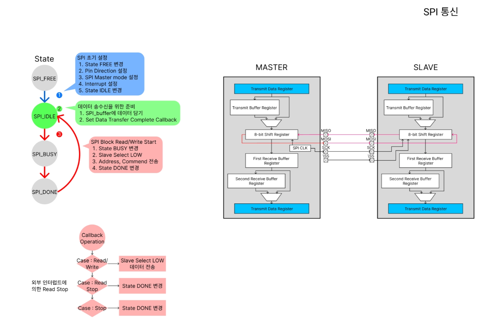

## 3. I2C 통신

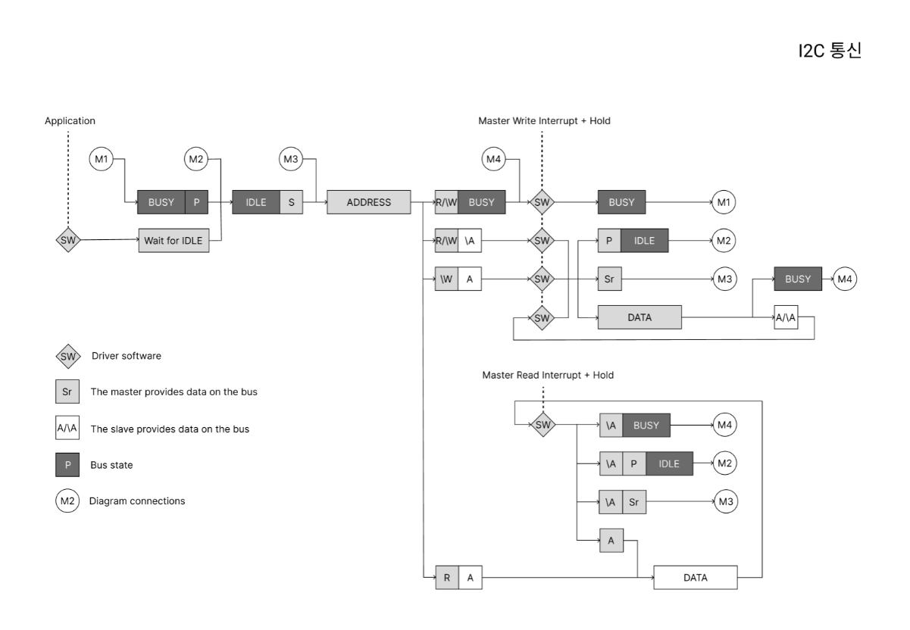